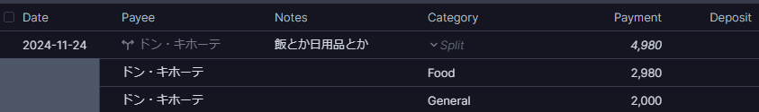
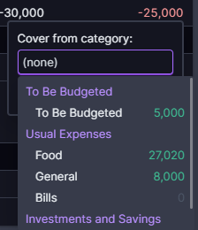

バイトで稼いだ給与の使い道を見直したかったので導入してみました。  
サーバー構築の方法は[公式ドキュメント](https://actualbudget.org/docs/install/)を見てください。[公式が用意しているデモ](https://demo.actualbudget.org)で一度試してみるのも手です。

※筆者は高校生の公共レベルでしか知識がありません。当記事を真似して起きた損害等の責任は一切負いかねます。自分の資産は自分で守ってください。

## Actual Budgetの特徴

- 「封筒予算」を採用している(後述)
- 全てローカル(またはセルフホストされたサーバー)にデータが保存される。E2Eも可能。
- JavaScriptのSDK経由で概要を取得したり、記録できる。  
  逆に言うとREST APIやWebhookは提供されていない。かなしい。

## 初期設定

Fileを作成したら、サイドバーの`More -> Settings`を開き設定を日本向けにカスタマイズしましょう。

- `Formatting -> Hide decimial places`にチェックを入れる
- `Formatting -> Dates`のフォーマットを`YYYY-MM-DD`(またはお好み)にする

## 最初のアカウント(口座)を作る

サイドバーの一番下の`Add account`をクリックしましょう。  
ヨーロッパやアメリカで使われてるアカウントと連携できるみたいですが、残念ながら日本の銀行は対応していないので、`Create local account`をクリックします。

`Name`には銀行の名前や、現金を管理するなら`Cash`とでも入れときましょう。  
`Balance`には追跡を開始する前の初期残高を入力します。

初期残高を入力した場合は`Starting Balance`が追加されていると思いますが、ひとまず置いておきましょう。

## アカウントに記録する

基本的には上部メニューの`Add New`をクリックして記録します。
勘で入力してみましょう。
|パラメータ|意味|
|---------|----|
|Date|記録する日付|
|Payee|支払い元/先|
|Notes|記録すべき事柄|
|Category|いくら使ったかを分類するためのカテゴリー(Food, Billsなど)|
|Payment|Payeeに支払った額(-で下記になる)|
|Deposit|Payeeから受け取った額(+で上記になる)|

なお、Categoryにフォーカスを当てて`Split Transaction`することで、金額の一部でカテゴリーを分けることができます。ドンキとか百貨店とかで買い物したとき便利。

## `Budget`メニューの見方

いくつか記録したあとにサイドバーの`Budget`をクリックすると、先程記録したカテゴリー毎にSpent(支出額)、Received(収入額)が記録されているはずです。  
FoodやBillsなどの支出を記録していると、Balanceの欄が赤文字でマイナスになっているはずです。  

これはBudgeted(予算)がSpent(支出額)を超過しているためです。

試しにFoodのBudgetedに30,000と入力すると、`30,000 - 2980 = 27,020`となり、予算内に収まっているという意味になります。  

これがActual Budgetの特徴である「封筒予算」(直訳)です。

## 予算を超過してしまった時は？

リソースを消し忘れてAWSに高額な請求されてしまった経験は誰にでもあると思います。ありますよね？  
そんな感じで予算オーバーしても大丈夫です。他の封筒に手をつければいいのです。
赤文字になっているBalanceをクリックし、`Cover overspending`を押してみましょう。削るカテゴリーを選ぶことができます。  

`To Budget`(翌月に使えるお金)から削るのが一番無難だと思いますが、もしできない場合は仕方ありません。食費を削りましょう。  
`Cover from category`に`Food`と入れて`Transfer`を押してみましょう。

食費が削れてBills (Flexible)のBalanceが0に戻りました。めでたしめでたし。

## まとめ

予算を配分し、記録して後から見直せるので、家計簿のPDCAサイクルを回すにはすごく良いツールだと思います。  
`Reports`で保有している資産やキャッシュフロー、支出額などをいつでも見返せますし、カスタムレポートで注視したいグラフを作ることもできます。  
`Schedules`で公共料金やサブスクの支払いを予定することもできますし、  
`Rules`を書くことである程度入力を自動化することもできます。  
なによりAPIが提供されているので、頑張ればカードの利用通知メールをパースしてアカウントに記録することもできます。これ構築したら便利すぎてやばいです。~~まぁ検証のために無駄遣いしたんですけど。~~

ただいくら計画を立てようとも実行するのは自分自身なので、頑張って無駄遣いしたい衝動を抑える必要があります。私には絶対無理です。ありがとうございました。
